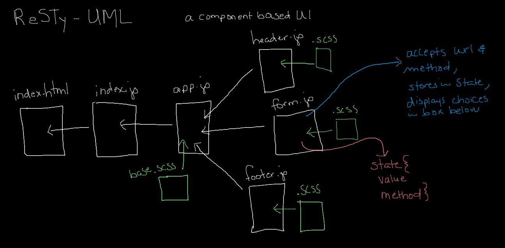

# LAB: Component Based UI | Class 27

## Project: RESTy

### Author: Ashley Biermann

### Links and Resources

- [submission PR](https://github.com/401-advanced-javascript-ashley-biermann/resty/pull/4)
- [ci/cd](https://github.com/401-advanced-javascript-ashley-biermann/notes/tree/master/.github/workflows) (GitHub Actions)
- [front-end application](https://401-advanced-javascript-ashley-biermann.github.io/resty/)
- [back-end server url]() (when applicable)

### Setup

#### `.env` requirements (where applicable)

#### How to initialize/run your application (where applicable)

- `npm start`

#### How to use your library (where applicable)

#### Tests

- `npm test`
- Still working on a test that requires use of a function with event.preventDefault.

#### UML

- 

